# Lab-How-To-Configure-Multipart-Upload-to-S3-Bucket-using-AWS-CLI

> [!Note]
> This lab needs to install AWS CLI first. If you don't know how to install it, please follow the instructions of this [guideline](https://docs.aws.amazon.com/cli/latest/userguide/getting-started-install.html) . After finished installation, you can proceed the following guideline;

- Type in terminal
```
aws --version
``` 
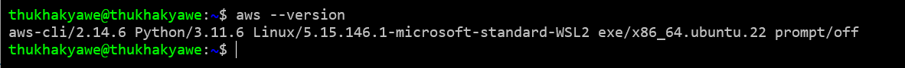

- Type in terminal
```
aws configure
```

- Fill information with your information

- `AWS Access Key ID [None]`: 

- `AWS Secret Access Key [None]:`

- `Default region name [None]:`

- `Default output format [None]:`

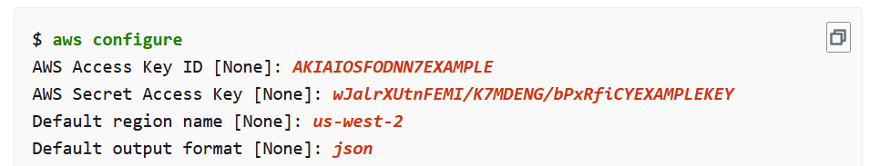

- Type in terminal
```
ll -h
```
- There is video file which has 432 MB

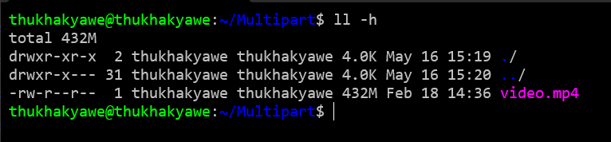

- Go to `S3` from AWS Management Console

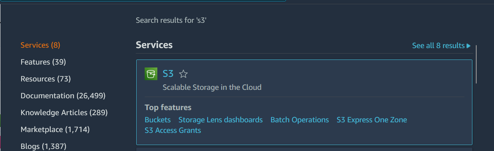

- Write Name at `Bucket name`

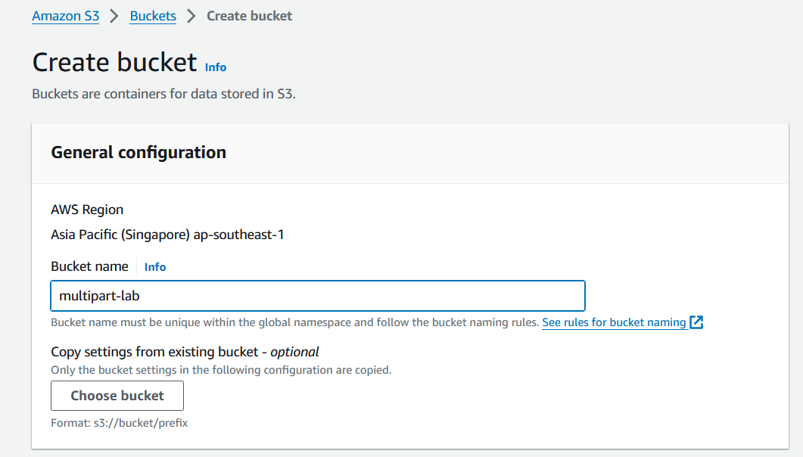

- Click `Create Bucket`

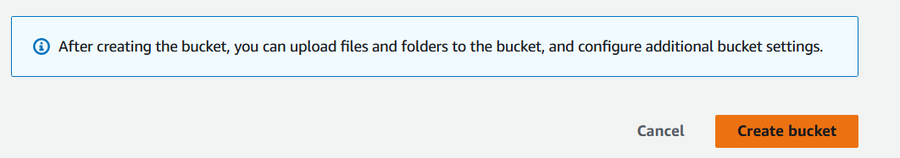

- Type in Terminal
```
split -b 200000000 video.mp4
```
```
ls -h
```

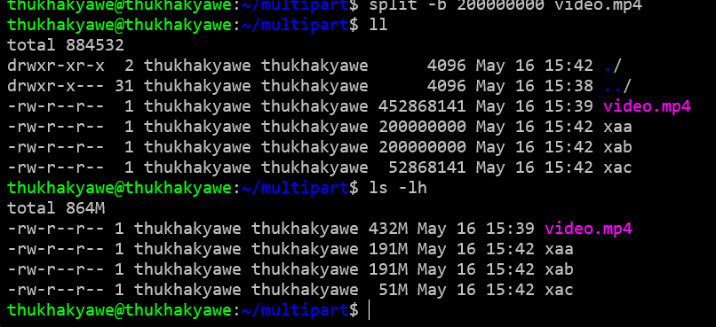

- Type in terminal

```
aws s3api create-multipart-upload --bucket multipart-lab --key video.mp4 
```
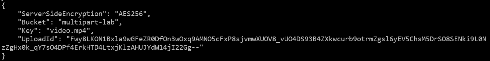

- Save `UploadID` in Notepad.It will use later. It will be like this.

`Fwy8LKON1Bxla9wGFeZR0DfOn3wOxq9AMNO5cFxP8sjvmwXUOV8_vUO4DS93B4ZXkwcurb9otrmZgsl6yEV5ChsM5DrSO8SENki9L0NzZgHx0k_qY7sO4DPf4ErkHTD4LtxjKlzAHUJYdW14jI22Gg--`

- Type in terminal

```
aws s3api upload-part --bucket multipart-lab --key video.mp4 --part-number 1 --body xaa --upload-id Fwy8LKON1Bxla9wGFeZR0DfOn3wOxq9AMNO5cFxP8sjvmwXUOV8_vUO4DS93B4ZXkwcurb9otrmZgsl6yEV5ChsM5DrSO8SENki9L0NzZgHx0k_qY7sO4DPf4ErkHTD4LtxjKlzAHUJYdW14jI22Gg--
```

- You will see like this and copy `ETag` Information to Notepad

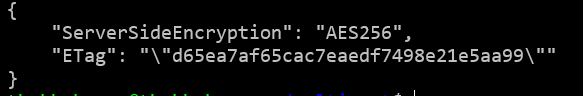

- Type in terminal

```
aws s3api upload-part --bucket multipart-lab --key video.mp4 --part-number 2 --body xab --upload-id Fwy8LKON1Bxla9wGFeZR0DfOn3wOxq9AMNO5cFxP8sjvmwXUOV8_vUO4DS93B4ZXkwcurb9otrmZgsl6yEV5ChsM5DrSO8SENki9L0NzZgHx0k_qY7sO4DPf4ErkHTD4LtxjKlzAHUJYdW14jI22Gg--
```

- You will see like this and copy `ETag` Information to Notepad

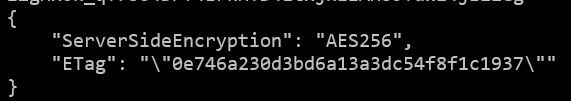

- Type in terminal

```
aws s3api upload-part --bucket multipart-lab --key video.mp4 --part-number 3 --body xac --upload-id Fwy8LKON1Bxla9wGFeZR0DfOn3wOxq9AMNO5cFxP8sjvmwXUOV8_vUO4DS93B4ZXkwcurb9otrmZgsl6yEV5ChsM5DrSO8SENki9L0NzZgHx0k_qY7sO4DPf4ErkHTD4LtxjKlzAHUJYdW14jI22Gg-- 
```

- You will see like this and copy `ETag` Information to Notepad

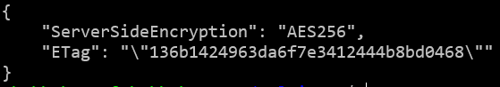

- Type in terminal

```
aws s3api list-parts --bucket multipart-lab --key video.mp4 --upload-id Fwy8LKON1Bxla9wGFeZR0DfOn3wOxq9AMNO5cFxP8sjvmwXUOV8_vUO4DS93B4ZXkwcurb9otrmZgsl6yEV5ChsM5DrSO8SENki9L0NzZgHx0k_qY7sO4DPf4ErkHTD4LtxjKlzAHUJYdW14jI22Gg--
```
- You will see like this 

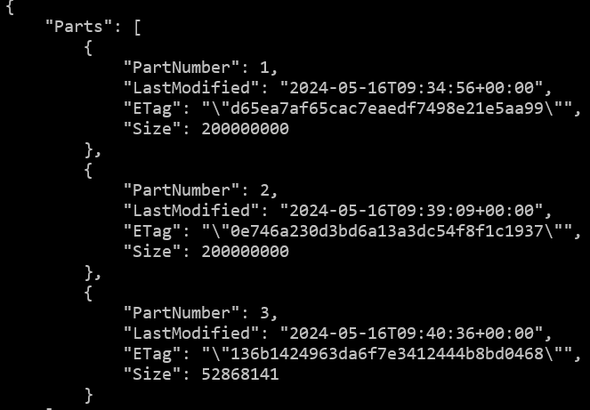

- Make the json file by using the following example json and replace with ETag Information

```
{
    "Parts": [{
        "ETag": "example8be9a0268ebfb8b115d4c1fd3",
        "PartNumber":1
    },

    ....

    {
        "ETag": "example246e31ab807da6f62802c1ae8",
        "PartNumber":4
    }]
}
```

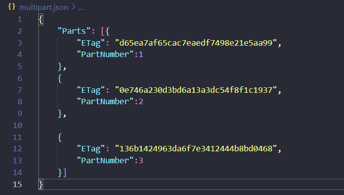

- Type in terminal

```
aws s3api complete-multipart-upload --multipart-upload file://multipart.json --bucket multipart-lab --key video.mp4 --upload-id Fwy8LKON1Bxla9wGFeZR0DfOn3wOxq9AMNO5cFxP8sjvmwXUOV8_vUO4DS93B4ZXkwcurb9otrmZgsl6yEV5ChsM5DrSO8SENki9L0NzZgHx0k_qY7sO4DPf4ErkHTD4LtxjKlzAHUJYdW14jI22Gg-- 
```

- You will see like this information

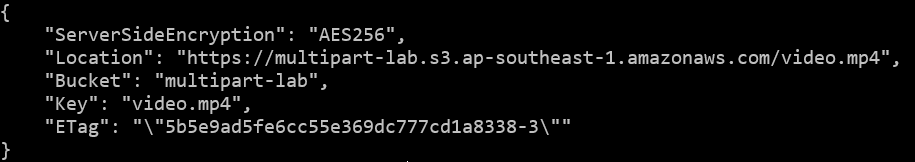

- Click `Refresh`

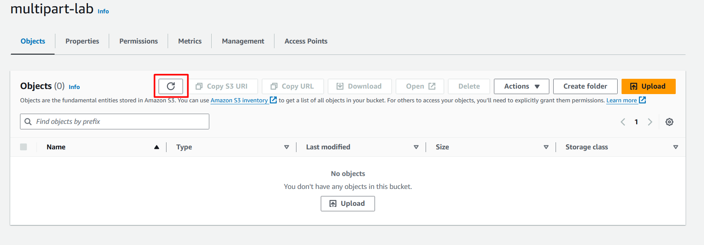

- You will see video.mp4 like this

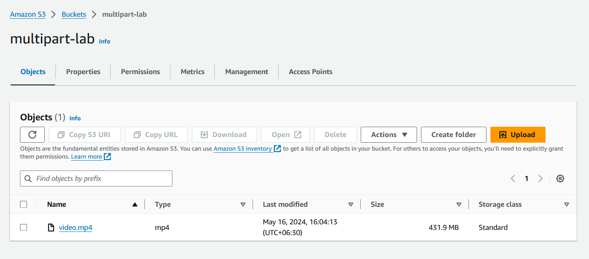

- Click `Management` and `Create lifecycle rule`

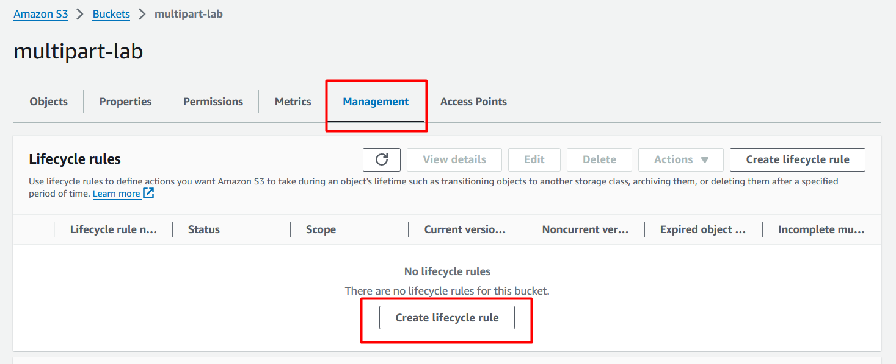

- Write rule name at `Lifecycle rule name` and click `I acknowledge that this rule will apply to all objects in the bucket.`

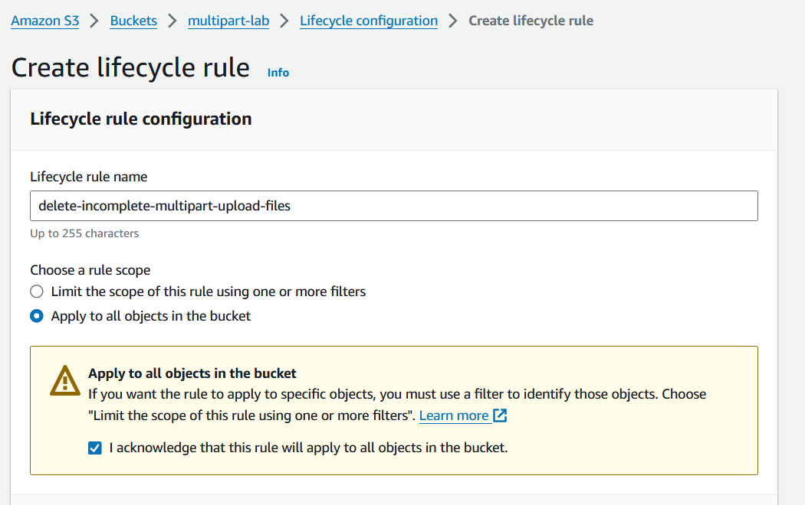

- Select `Delete expired object delete markers or incomplete multipart uploads `

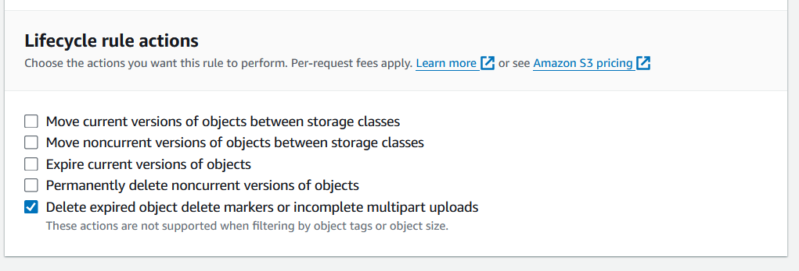

- Select `Delete incomplete multipart uploads` and Choose `1` at `Number of days`

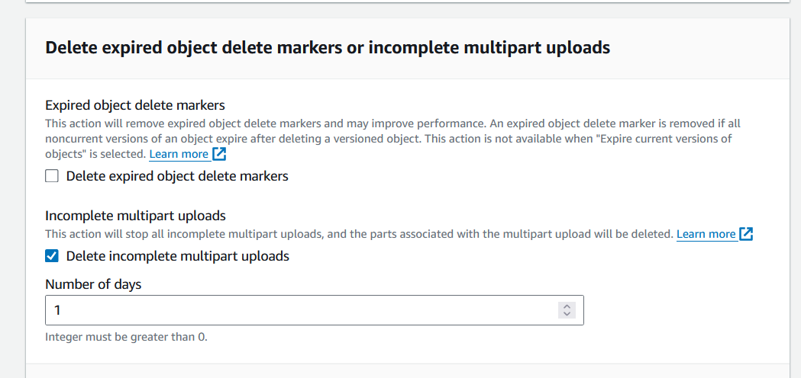

- Click `Create Rule`

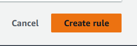

---
***Congratulations.You have completed Lab-How To Configure Multipart Upload to S3 Bucket using AWS CLI***

---
